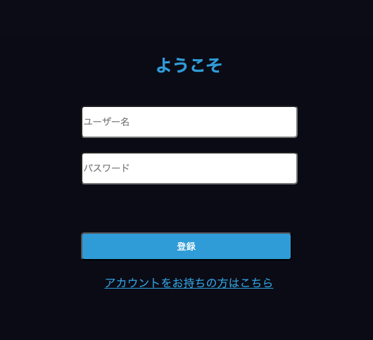
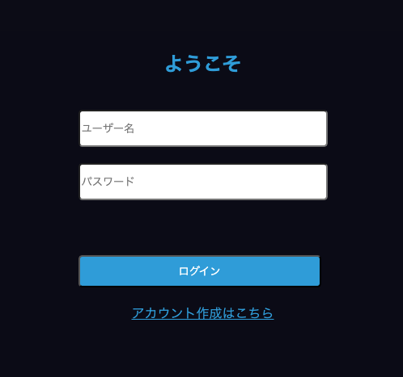
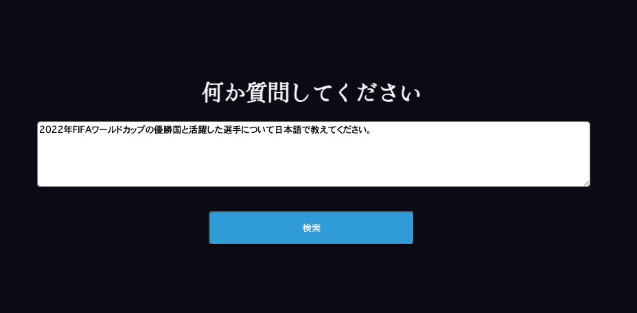
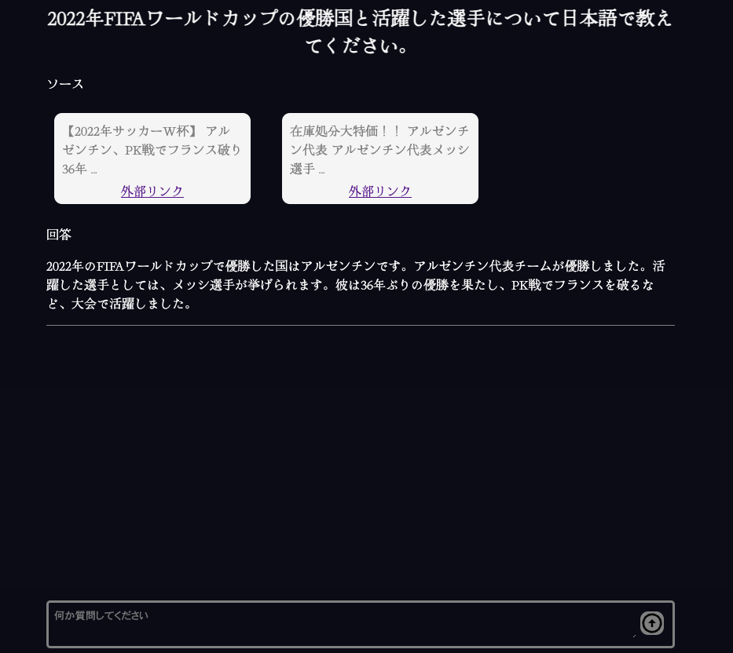
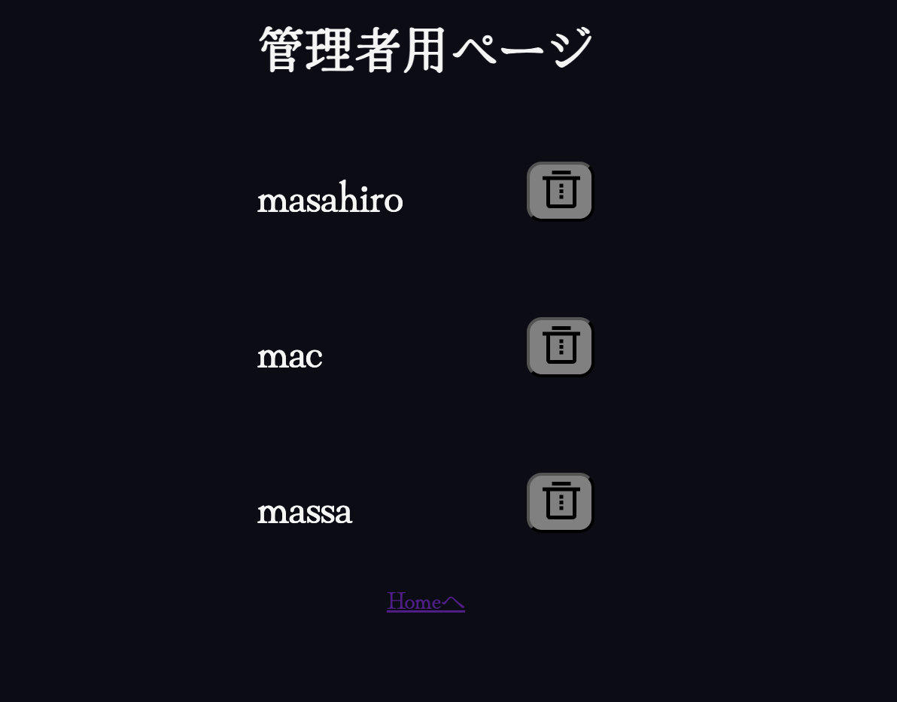
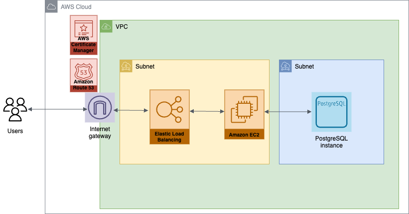

# BTC6 他言語プロジェクト 06\_まっさ

自分が作ってみたいと思えるアプリを作りました

制作期間：2024/6/10〜2024/6/14

キーワード：

- FE: React + TypeScript + SCSS. BE: Kotlin + SpringBoot + PostreSQL
- LangChain を使用した AI 検索エンジン
- Spring Security による認証・認可
- AWS へのデプロイ

## アプリの説明

### ① 認証・認可



機能：

- ユーザー名とパスワードを入力してアカウント作成
- ユーザー名は unique



機能：

- 作成したユーザー名とパスワードを入力してログイン
- ユーザー名もしくはパスワードが誤っているとエラーが表示される

### こだわりポイント

アカウント作成とログインページは SSR で実装した。React は SPA なので build されたファイルを丸ごとクライアントに返却するが、ログインしていないユーザーには React ファイルを返却したくないと考え、ログインした後で React ファイルを返却するよう実装した。

### ② AI 検索エンジン



機能：

- AI 検索エンジンで検索したい内容を入力して「検索」をクリック



機能：

- OpenAI の gpt-3.5-turbo を使用して検索内容を解析
- Google Custom Search API を使用して最新情報を検索
- 検索した内容を基に gpt が回答を生成
- 回答内容の表示はストリーム形式で一文字ずつ表示される

### こだわりポイント

LangChain を使用することで LLM をカスタマイズしている。LLM は最新情報を学習していないので最新情報に関する問いには答えられない。Google 検索を組み合わせることで最新情報にも答えられる。レスポンシブデザインにも対応。

### ③ 管理者用ページ



機能：

- ユーザー一覧が閲覧できる
- 削除ボタンを押すとユーザーを削除できる

## アプリの再現方法

### ① 全体の環境構築

任意のディレクトリに本リポジトリをクローンする

ディレクトリの構成は下記

```
backend
  src
    main
      kotlin
      resources
        db
        static
        templates
        application.properties
    test
      kotlin
      resources
  build.gradle.kts
frontend
  public
  src
    components
    App.tsx
  .env
  package.json
  vite.config.ts
README
```

terminal にてデータベースを作成

```
$ createdb otherlangdb
```

### ② フロントエンドの設定

fronend/.env

```
VITE_GOOGLE_API_KEY = <your google api key>
VITE_GOOGLE_CUSTOM_SEARCH_ID = <your google custom search id>
VITE_OPENAI_API_KEY = <your openai api key>
```

[Google API](https://console.developers.google.com/)
[OpenAI API](https://openai.com/api/)

frontend 直下 terminal で下記コマンドを実行

```
$ npm install
$ npm run build
```

backend/src/main/resources/static ディレクトリにビルド結果が格納される

### ③ バックエンドの設定

backend 直下 terminal で下記コマンドを実行

```
$ ./gradlew build
```

### ④ localhost でアプリを試行する

backend 直下 terminal で下記コマンドにより localhost サーバーを起動

```
$ ./gradlew bootrun
```

http://localhost:80 にアクセス

下図のような画面になっていれば成功


## AWS にデプロイ

下図のような構成でデプロイする


デプロイ先 URL

[https://www.btc6-solomvp.net](https://www.btc6-solomvp.net)

参考資料は下記

- [EC2 と PostgreSQL](https://docs.aws.amazon.com/ja_jp/AmazonRDS/latest/UserGuide/CHAP_GettingStarted.CreatingConnecting.PostgreSQL.html)
- [EC2 と https 化](https://qiita.com/nozomiyamada/items/1d18d87a85b798f5eaf5)
- [Route53 とお名前.com](https://dev.classmethod.jp/articles/route53-domain-onamae/)
